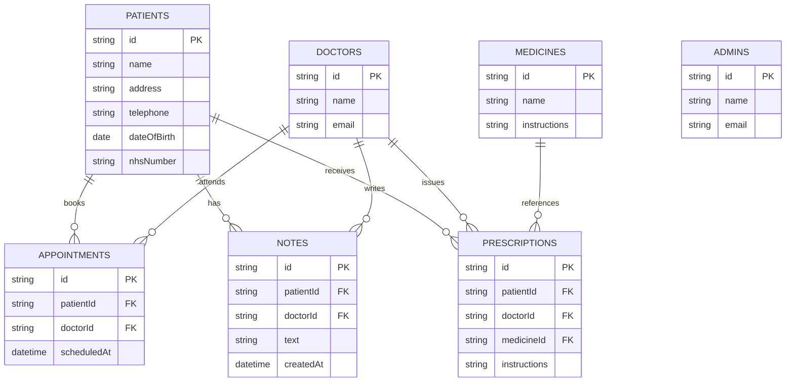

# CareLocal data model

```mermaid
erDiagram
  PATIENTS ||--o{ APPOINTMENTS : books
  DOCTORS ||--o{ APPOINTMENTS : attends
  PATIENTS ||--o{ NOTES : has
  DOCTORS ||--o{ NOTES : writes
  PATIENTS ||--o{ PRESCRIPTIONS : receives
  DOCTORS ||--o{ PRESCRIPTIONS : issues
  MEDICINES ||--o{ PRESCRIPTIONS : references
  PATIENTS {
    string id PK
    string name
    string address
    string telephone
    date dateOfBirth
    string nhsNumber
  }
  DOCTORS { string id PK string name string email }
  ADMINS { string id PK string name string email }
  MEDICINES { string id PK string name string instructions }
  APPOINTMENTS { string id PK string patientId FK string doctorId FK datetime scheduledAt }
  NOTES { string id PK string patientId FK string doctorId FK string text datetime createdAt }
  PRESCRIPTIONS { string id PK string patientId FK string doctorId FK string medicineId FK string instructions }
```
